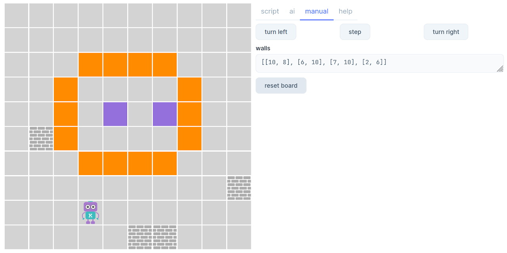
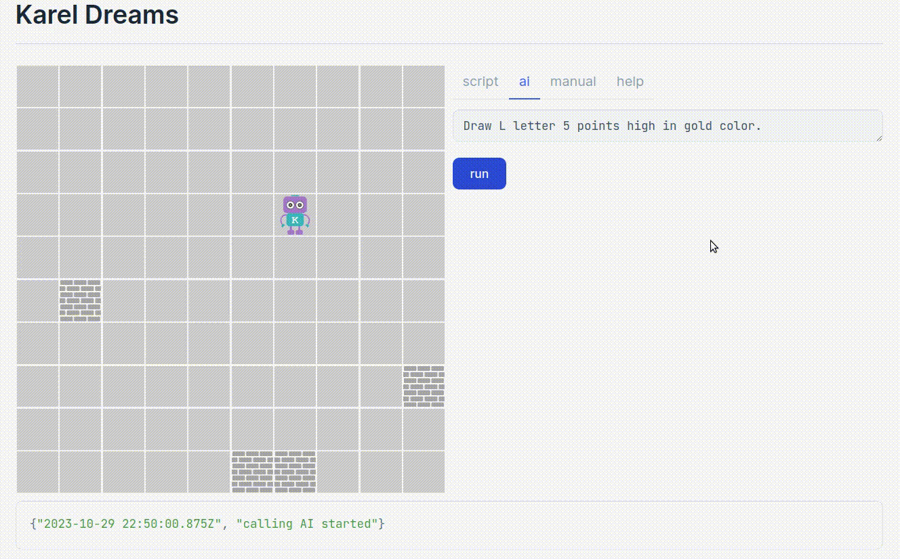

# Karel Dreams

Control a robot named Karel moving on a board using the AI!  (Or with a script.)

This is a [Livebook app]((https://livebook.dev/)) created as an entry for the [SpawnFest 2023](https://spawnfest.org/) contest.



## Inspiration

In 1920, a Czech writer [Karel Čapek](https://en.wikipedia.org/wiki/Karel_%C4%8Capek) wrote a sci-fi play [R.U.R.](https://en.wikipedia.org/wiki/R.U.R.) where he introduced the word ["robot"](https://thereader.mitpress.mit.edu/origin-word-robot-rur/). This word was inspired by the Czech word "robota" which means "corvée" or "serf labor" - forced unpaid labor of the peasants for their feudal lords.

Then in the 1970s, Richard E. Pattis in the USA created a simple programming language for educational purposes. This programming language controls the movements and actions of a **robot on a board**. He named the robot and the [programming language Karel](https://en.wikipedia.org/wiki/Karel_(programming_language)), after Karel Čapek. (The Karel language has inspired the development of various clones, among others, unsurprisingly, a Czech version which was quite popular.)

Today, Karel Čapek's vision of artificial servants - intelligent robots is coming to life. It has inspired us to recreate the Karel programming language - and this time to **connect it to the AI**. Thus to symbolically fulfill Karel Čapek's vision and to complete the circle. That's why we've named our project "Karel Dreams".

## How to run the project

Download the `karel_dreams.livemd` file and open it in the [Livebook](https://livebook.dev/). The app is standalone.

To fully enjoy, **deploy the notebook as an app**.
Go to **App settings** in the Livebook's left menu and deploy from there. (You can check out this [video by José Valim](https://youtu.be/q7T6ue7cw1Q?si=Pf2Rwdo6owd4JgiM&t=511) on how to do it.) _(Note: Keep the "Only render rich outputs" in the deploy configuration unchecked. It somehow interferes with the grid layout used in the app - maybe a bug?)_

## Controlling the robot

Karel understands 5 basic instructions: `turn-left`, `turn-right` and `step` (move one step forward) and also `put-color` (paint the cell he is standing on with a specified color) and `clear-color` (remove the color). Color instructions can be used to draw using Karel's movements :-)

You can control Karel in 3 different ways: **with a script**, **with AI** (using natural language) or **manually** (using buttons). You can easily switch between them.

### Using a script

Script uses a list of instructions that will be executed sequentially.

Here's for example an instruction that will make Karel go around a small square:

```
    [
      "step", "step", "turn-right", "step", "step",
      "turn-right", "step", "step",
      "turn-right", "step", "step"
    ]
```

This is how to instruct Karel to paint the cell he's standing on with a color:

`{"put-color": "HTMLColorName"}`

This is for how to "draw" a purple shape of "U":

 ```
    [
      {"put-color": "purple"}, "step",
      {"put-color": "purple"}, "step",
      {"put-color": "purple"}, "turn-left", "step",
      {"put-color": "purple"}, "step",
      {"put-color": "purple"}, "turn-left", "step",
      {"put-color": "purple"}, "step",
      {"put-color": "purple"}
    ]
```


### Using the AI

This is where the fun begins! You can control Karel using natural written language.

_Note: For this feature to work you need to have tokens (credit)._

You can write: `Go 3 steps forward, then turn left, then move two steps.`, which will be translated to `["step", "step", "step", "turn-left", "step", "step"]` and Karel will perform the moves.

You can also instruct him to **"draw"**, then he will not only move but paint the cell with color as well.

You can try for example this: `Draw red, move 3 steps, then draw pink, turn left, go 2 steps and draw orange.`, or even try to draw shapes: `Draw a yellow line 4 units long.`

**To set up this feature**, please add your [OpenAI API key](https://platform.openai.com/account/api-keys) to the Secrets under the name `OPENAI_KEY`.

**How does it work?** We translate written instructions to JSON using OpenAI's GPT-3.5. To communicate with the ChatGPT API, we use the [Elixir LangChain library](https://github.com/brainlid/langchain).

Karel is not very intelligent (yet). He is able to follow the movement instructions, but when instructed to draw shapes, he sometimes gets confused and wanders away...

We hope you'll have fun exploring what Karel can understand! :-)


